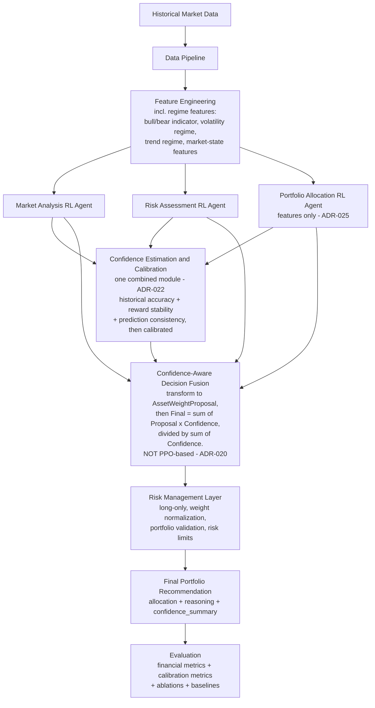
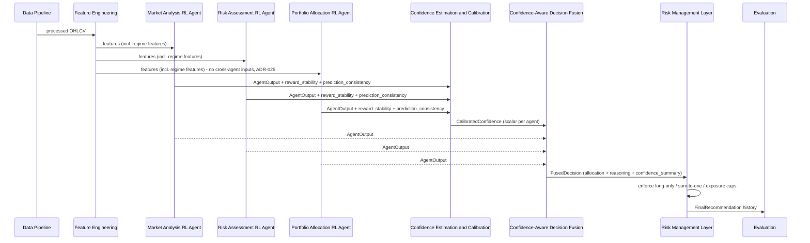
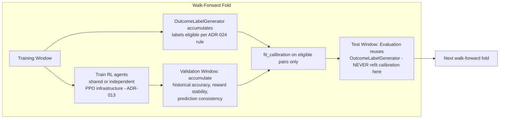
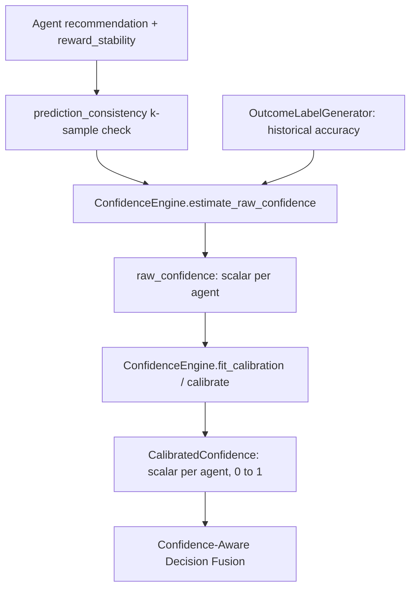

# ARCHITECTURE.md

> Full software architecture — **frozen** per the finalized architectural decisions. Read after [PROJECT_CONTEXT.md](./PROJECT_CONTEXT.md). Research-facing detail (purpose, theory, math) lives in [MODULE_SPECIFICATIONS.md](./MODULE_SPECIFICATIONS.md); engineering-facing detail (classes, contracts, failure cases) lives in [AGENTS.md](./AGENTS.md) and [INTERFACE_CONTRACTS.md](./INTERFACE_CONTRACTS.md); why these choices were made lives in [DECISIONS.md](./DECISIONS.md).

---

## 1. System Overview

CA-MARL is a pipeline, not a monolith. Each stage has exactly one responsibility:

1. **Data Pipeline** — download, validate, version market data.
2. **Feature Engineering** — leakage-safe technical/statistical features, **including regime signals** (bull/bear indicator, volatility regime, trend regime, market-state features — ADR-016; no standalone Regime Module).
3. **Three Specialized Reinforcement Learning Agents** — Market Analysis, Risk Assessment, and Portfolio Allocation agents, implemented within the FinRL ecosystem and trained via Stable-Baselines3 PPO (ADR-013). Each consumes Feature Engineering output only — the Portfolio Allocation Agent does **not** consume the other two agents' outputs (ADR-025). Whether the three agents share training infrastructure or are trained independently is an implementation detail.
4. **Confidence Estimation & Calibration** — **one combined module** (ADR-022; corrected from an earlier draft that showed this as two separate stages). Estimates raw confidence per agent from historical accuracy, reward stability, and prediction consistency (ADR-023), then normalizes and calibrates it onto a comparable, validated scale (ADR-003).
5. **Confidence-Aware Decision Fusion** — the project's primary research contribution. A dedicated, deterministic module, **exclusively separate from PPO** (ADR-014, ADR-015), that transforms each agent's heterogeneous recommendation into a common `AssetWeightProposal` representation and fuses them using calibrated confidence (ADR-020).
6. **Risk Management Layer** — long-only constraints, weight normalization, portfolio validation, risk limits; produces the Final Portfolio Recommendation.
7. **Evaluation** (ADR-021) — financial metrics, calibration metrics, ablations, baseline comparison. Full spec: `MODULE_SPECIFICATIONS.md` §7, `AGENTS.md` §7, `INTERFACE_CONTRACTS.md` §7.

**PPO is the training algorithm for the three specialized agents. It is never the fusion mechanism.** See ADR-015.

## 2. Architecture Diagram

## 3. Module Interactions

| From | To | Payload |
|---|---|---|
| Data Pipeline | Feature Engineering | Validated, versioned OHLCV DataFrame, one schema |
| Feature Engineering | all 3 RL Agents | Feature DataFrame — technical indicators, volatility, returns, regime features |
| Each RL Agent | Confidence Estimation & Calibration | `AgentOutput` (recommendation, `metadata["reward_stability"]`, reasoning) |
| Each RL Agent | (its own) `prediction_consistency()` result | consumed by Confidence Estimation & Calibration |
| Confidence Estimation & Calibration | Confidence-Aware Decision Fusion | `CalibratedConfidence` (scalar per agent) + diagnostics |
| Each RL Agent | Confidence-Aware Decision Fusion | `AgentOutput` (recommendation, reasoning) — consumed directly, alongside calibrated confidence |
| Confidence-Aware Decision Fusion | Risk Management Layer | `FusedDecision` (final_allocation, reasoning, confidence_summary, fusion_metadata) |
| Risk Management Layer | Final Portfolio Recommendation, Evaluation | `FinalRecommendation` (allocation, reasoning, confidence_summary — reasoning/confidence_summary passed through unchanged, ADR-019) |
| Confidence Estimation & Calibration's `OutcomeLabelGenerator` | Evaluation | reused, not reimplemented (ADR-024) |

**Golden rules:**
- No module skips a stage.
- The Confidence-Aware Decision Fusion module never trains via RL and is never described as part of PPO.
- The Confidence Estimation & Calibration module never makes an investment decision itself.
- There is no standalone Regime Module (ADR-016).
- The Portfolio Allocation Agent never consumes the Market or Risk agents' outputs (ADR-025).
- No field on `FinalRecommendation` is populated by "magic" — every field's origin is documented (ADR-019; see `INTERFACE_CONTRACTS.md`).

## 4. Execution Flow (Inference Time)

## 5. Data Flow (Training/Evaluation Time)

Calibration data-leakage risk must be respected exactly per ADR-024's concrete rule: a (confidence, label) pair is eligible for calibration fitting in fold *F* iff `recommendation.timestamp + label_horizon ≤ F.training_window.end`.

## 6. Confidence Flow (Detail)

## 7. Confidence-Aware Decision Fusion — Pointer Only

**Full detail (formula, `AssetWeightProposal` transform functions, worked numeric example, edge cases, `reasoning`/`confidence_summary` composition): [CONFIDENCE_FUSION.md](./CONFIDENCE_FUSION.md).** Not restated here to avoid the documentation duplication flagged in the prior Design Review — `CONFIDENCE_FUSION.md` is the sole authoritative source for this module's mechanics; `AGENTS.md` §5 and `MODULE_SPECIFICATIONS.md` §5 each carry only a short cross-reference summary, matching this document's treatment.

## 8. Evaluation — Pointer Only

**Full detail: `MODULE_SPECIFICATIONS.md` §7 (theory/formulation), `AGENTS.md` §7 (engineering contract), `INTERFACE_CONTRACTS.md` §7 (`EvaluationEngine` class, method signatures, data structures).** Evaluation consumes the Final Portfolio Recommendation history plus the same `OutcomeLabelGenerator` used during training-time calibration (ADR-024), guaranteeing evaluation-time and training-time "correctness" are defined identically.

## 9. Future Extensibility

- Confidence Estimation inputs may be extended with additional signals without changing the pipeline shape.
- A learned (rather than deterministic-formula) fusion mechanism is a possible future direction, explicitly out of current scope — see `CONFIDENCE_FUSION.md` §Future Work.
- Additional markets/universes: config-driven ticker list should allow swapping in a second market as a robustness check without code changes.

---

**Related documents:** [MODULE_SPECIFICATIONS.md](./MODULE_SPECIFICATIONS.md) · [AGENTS.md](./AGENTS.md) · [INTERFACE_CONTRACTS.md](./INTERFACE_CONTRACTS.md) · [CONFIDENCE_FUSION.md](./CONFIDENCE_FUSION.md) · [DECISIONS.md](./DECISIONS.md) · [DIRECTORY_STRUCTURE.md](./DIRECTORY_STRUCTURE.md)
